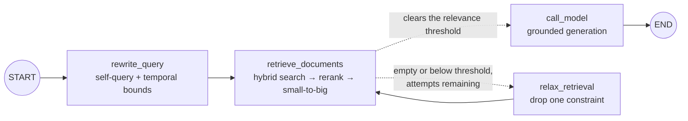
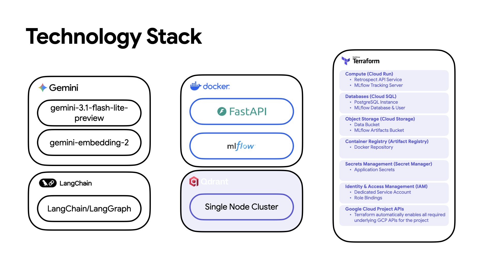

# Retrospect RAG

This project was built as a production-grade ML engineering demonstration, showcasing end-to-end RAG system design from ingestion pipeline architecture through hybrid retrieval, cross-encoder reranking, and LLM-as-judge evaluation.

Retrospect is a modular RAG system for personal journals and diaries.

This project demonstrates a robust architecture for securely ingesting private, first-person entries, zero-shot structured extraction of JSON metadata (emotions, topics, people, places), and orchestrating empathetic LLM generation. Everything is wrapped within a scalable FastAPI service and fully containerized using Docker.

The same application code supports two deployment modes: a fully local stack, where Gemma and the embedding model are served by Ollama and no entry ever leaves the host machine, and a cloud stack on GCP, where inference is handled by Gemini and the entire footprint is provisioned with Terraform. See [Technology Stack](#technology-stack) for a side-by-side comparison.

## Architecture: Offline & Online Phases

The system is cleanly decoupled into two distinct operational phases:

### 1. Offline Phase (Data Ingestion & Indexing)
- **Document Processing**: Parses raw diary text files, performing structural and token-based chunking.
- **LLM Metadata Extraction**: Uses a local model (`gemma4:26b-mlx` via Ollama) for zero-shot structured extraction of JSON metadata tracking emotions, sentiment, people, and locations.
- **Embedding Generation**: Converts diary chunks into dense vector representations using `embeddinggemma` via Ollama, and sparse SPLADE vectors via `fastembed`.
- **Temporal Encoding**: Stores each entry's ISO date twice, as a human-readable string folded into the embedded text and as an indexed integer (`date_ts`, epoch seconds) that Qdrant serves range queries against.
- **Vector Storage**: Indexes dense vectors, sparse SPLADE vectors, and extracted metadata filters into **Qdrant** for hybrid search retrieval.


### 2. Online Phase (Query & Generation)
- **Query Rewriting & Self-Querying**: Intercepts natural language questions, stripping conversational filler and enriching the core concepts with probable diary synonyms (e.g., from "sad" to "crying, heartbroken"), while emitting deterministic metadata filters. Every filter is validated through Pydantic (`TranslatedQuery`) before it reaches Qdrant, so an off-vocabulary or malformed value is dropped rather than silently matching zero points.
- **Temporal Filtering**: Pins the current date into the rewrite prompt so relative expressions ("last month", "since March") resolve into absolute `date_from` and `date_to` bounds, applied as an inclusive Qdrant range condition over the indexed `date_ts` field. Vague life-stage phrases ("in college") are deliberately left to the semantic query.
- **Hybrid Retrieval**: Executes dense and sparse searches as parallel prefetch paths within a single `query_points` call, with Qdrant-native RRF fusion, eliminating multiple round-trips and pushing all fusion logic to the database layer.
- **Cross-Encoder Re-ranking**: Utilizes a Cross-Encoder (`ms-marco-MiniLM-L-6-v2`) to re-rank the fused top results for maximum relevance against the rewritten query.
- **Cyclic Self-Correcting Retrieval**: Loops rather than running straight through. A conditional edge inspects each retrieval pass, and if it returned nothing, or nothing that cleared the cross-encoder relevance threshold, control returns to a `relax_retrieval` node that surrenders one constraint and searches again. This guards a concrete failure mode: an over-eager self-query filter excludes every point during the prefetch stage, leaving RRF fusion with no candidates to rank and the generation model with no context.
- **Small-to-Big Retrieval**: Retrieves highly specific, smaller chunks via hybrid search, but feeds their larger, complete parent documents to the LLM to provide broader context, deduplicating parent IDs on the fly.


## The LangGraph Pipeline

### Graph Topology



Dashed edges represent the conditional branch, of which `should_retry_retrieval` selects exactly one per pass. The solid edge from `relax_retrieval` back into `retrieve_documents` closes the cycle.

### Nodes

| Node | Span type | Reads from state | Writes to state |
| --- | --- | --- | --- |
| `rewrite_query` | `TOOL` | `messages` | `search_query`, `filters`, `original_query`, `retrieval_strategy`, `retrieval_attempts`, `retrieval_top_k`, `top_score`, `token_usage`, `latency_ms` |
| `retrieve_documents` | `RETRIEVER` | `messages`, `search_query`, `filters`, `retrieval_strategy`, `retrieval_top_k`, `retrieval_attempts` | `context`, `top_score`, `retrieval_attempts`, `latency_ms` |
| `relax_retrieval` | `TOOL` | `retrieval_strategy`, `filters`, `original_query` | `retrieval_strategy`, `filters`, `search_query`, `retrieval_top_k` |
| `call_model` | `CHAT_MODEL` | `context`, `messages`, `system_prompt` | `messages`, `token_usage`, `latency_ms` |

- **`rewrite_query`**: Issues a single JSON-mode LLM call that strips conversational filler, expands diary synonyms, and emits metadata and date-range filters. Validates the output through `TranslatedQuery` before anything reaches Qdrant.
- **`retrieve_documents`**: Fuses dense and sparse prefetch paths with Qdrant-native RRF in a single `query_points` call, re-ranks the pool with the Cross-Encoder, then expands small-to-big and deduplicates by `document_id`. Runs once per loop pass.
- **`relax_retrieval`**: Forms the body of the cycle, surrendering exactly one constraint before handing control back to retrieval.
- **`call_model`**: Folds the retrieved parent documents into the grounded system prompt and generates the answer. When no context survives retrieval it still responds, with the prompt instructing it to say so rather than invent one.

`should_retry_retrieval` is the conditional edge, not a node: it reads `context`, `top_score`, `retrieval_attempts`, and `retrieval_strategy`, and returns the name of the next node.

### State Channels

`RetrospectState` extends LangGraph's `MessagesState`. Channels are last-write-wins unless a reducer says otherwise:

| Channel | Type | Reducer | Purpose |
| --- | --- | --- | --- |
| `messages` | `list[AnyMessage]` | append | Conversation turns, including the final reply. |
| `session_id` | `str` | last write | Ties the run to an HTTP session; surfaces as an MLflow tag. |
| `system_prompt` | `str \| None` | last write | Optional caller-supplied instruction, prepended to the RAG prompt. |
| `search_query` | `str \| None` | last write | The query actually sent to Qdrant. Restored to the verbatim question on the `broad` rung. |
| `filters` | `dict \| None` | last write | Validated self-query filters. Cleared by `relax_retrieval`. |
| `context` | `list[Chunk]` | last write | Parent documents handed to the generation model. |
| `original_query` | `str \| None` | last write | The verbatim user question, kept so the rewrite can be undone. |
| `retrieval_strategy` | `str` | last write | Current rung: `filtered`, `unfiltered`, or `broad`. |
| `retrieval_attempts` | `int` | last write | Passes so far. The loop's hard stop. |
| `retrieval_top_k` | `int \| None` | last write | Candidate pool size for the current pass. |
| `top_score` | `float \| None` | last write | Best Cross-Encoder score in the pass, the relevance signal tested by the conditional edge. |
| `token_usage` | `dict[str, int]` | `add_metrics` (sums) | Accumulated across every LLM call in the run. |
| `latency_ms` | `dict[str, float]` | `add_metrics` (sums) | Per-stage timings. Because it sums, `retrieval_ms` reports total time across all loop passes, not just the last. |
| `error` | `str \| None` | last write | Human-readable failure message. |

### The Retrieval Loop

Each trip around the cycle drops one constraint, so a retry is never a verbatim repeat of the pass that just failed:

| Pass | Strategy | Query | Filters | Pool |
| --- | --- | --- | --- | --- |
| 1 | `filtered` | rewritten | metadata + date | `retrieval_top_k` |
| 2 | `unfiltered` | rewritten | dropped | `retrieval_top_k` |
| 3 | `broad` | verbatim user question | none | `retrieval_broad_top_k` |

Termination is guaranteed three independent ways: the attempt budget (`retrieval_max_attempts`), an exhausted relaxation ladder, and an empty message list. A pass that finds nothing still increments the attempt counter, so the loop cannot spin against a permanently empty store. Rungs that would be no-ops are skipped, so a query that produced no filters in the first place jumps straight to `broad` rather than spending an attempt on an identical search. Every pass emits its own MLflow span tagged with its strategy, attempt number, and top score, so the loop is visible in a trace.

## Technology Stack

Retrospect runs in two deployment modes. The application layer is identical in both, comprising the same LangGraph pipeline, the same FastAPI service, and the same Qdrant collection layout. What differs is where inference happens and what provisions the surrounding infrastructure.

### Shared by Both Modes

- **Python 3.12**
- **Framework**: FastAPI
- **LLM/Orchestration**: LangChain & LangGraph
- **Vector Store**: Qdrant
- **Sparse Vectors**: SPLADE via `fastembed`
- **Re-ranking**: `ms-marco-MiniLM-L-6-v2` Cross-Encoder
- **Observability**: MLflow
- **Evaluation**: Ragas & DeepEval
- **Containerization**: Docker & Docker Compose
- **Tooling**: Make, Pytest, Ruff, Mypy

### Local & Cloud Differences

| | Local | Cloud (GCP) |
| --- | --- | --- |
| **Generation Model** | `gemma4:26b-mlx` via Ollama | `gemini-3.1-flash-lite-preview` |
| **Embedding Model** | `embeddinggemma` via Ollama | `gemini-embedding-2` |
| **Vector Store** | Qdrant container | Qdrant single-node cluster |
| **API Service** | Docker Compose | Cloud Run |
| **MLflow Tracking Server** | Docker Compose | Cloud Run |
| **MLflow Backend Store** | SQLite on a Docker volume | Cloud SQL (PostgreSQL) |
| **Data & Artifacts** | Docker volumes | Cloud Storage buckets |
| **Container Images** | Built locally | Artifact Registry |
| **Secrets** | `.env` file | Secret Manager |
| **Identity** | Not applicable | Dedicated service account with IAM role bindings |
| **Provisioning** | Docker Compose | Terraform |

### Cloud Deployment (GCP)



Inference is handled by the Gemini API, so no model weights are hosted and the API service remains stateless and horizontally scalable behind Cloud Run. Terraform provisions the entire footprint, including enabling the underlying Google Cloud project APIs, making the environment reproducible from an empty project:

- **Compute (Cloud Run)**: Hosts the Retrospect API service and the MLflow tracking server as separate services.
- **Databases (Cloud SQL)**: Provides a PostgreSQL instance backing MLflow, with a dedicated database and user in place of the local SQLite file.
- **Object Storage (Cloud Storage)**: Holds a data bucket for journal entries and a separate bucket for MLflow artifacts.
- **Container Registry (Artifact Registry)**: Stores the built Docker images for the deployed services.
- **Secrets Management (Secret Manager)**: Supplies application secrets at runtime instead of baking them into images or `.env` files.
- **Identity & Access Management (IAM)**: Binds a dedicated service account to explicit roles rather than relying on the default compute identity.

> **Note:** Infrastructure code is not included in this repository. The section above documents the deployed cloud architecture.

## Tuning Retrieval

All knobs live in `app/config.py` and can be overridden via environment variables:

| Setting | Default | Purpose |
| --- | --- | --- |
| `RETRIEVAL_TOP_K` | `20` | Candidate pool fetched from Qdrant per pass. |
| `RETRIEVAL_BROAD_TOP_K` | `40` | Wider pool for the final broadened pass. |
| `RETRIEVAL_FINAL_K` | `5` | Re-ranked documents handed to the generation model. |
| `RETRIEVAL_MAX_ATTEMPTS` | `3` | Passes through the retrieval loop. **Set to `1` to disable the loop.** |
| `RETRIEVAL_RELEVANCE_THRESHOLD` | `0.0` | Minimum cross-encoder score for a pass to count as relevant. `ms-marco-MiniLM` emits logits roughly in `-11..+11`, where `>0` indicates relevance. |

## Project Structure

```text
.
├── app/                  # FastAPI application code
│   ├── api/              # API routers and endpoints
│   ├── config.py         # App configuration settings
│   ├── date_utils.py     # Shared date <-> epoch encoding for temporal filters
│   ├── domain/           # Core domain models (Pydantic)
│   ├── graph/            # LangGraph pipeline definition
│   ├── main.py           # FastAPI application entry point
│   ├── prompts.py        # Centralized LLM instruction templates
│   └── services/         # Business logic and external service integrations
├── data/                 # Data directory for document ingestion
├── docker/               # Dockerfiles and container configurations
├── evals/                # Evaluation configurations and scripts
├── tests/                # Unit and integration tests
├── .env.example          # Example environment variables
├── requirements-eval.txt # Pinned DeepEval + Ragas harnesses (installed by `make eval`)
├── docker-compose.yml    # Production Docker services
├── docker-compose.override.yml # Development Docker overrides (hot-reload)
├── Makefile              # Helper commands
└── pyproject.toml        # Python project dependencies and tool configuration
```

## Getting Started (Local Deployment)

### Prerequisites
- Docker and Docker Compose
- [Ollama](https://ollama.com/) installed and running on your host machine (default port: `11434`)
- Python 3.12 (if running locally without Docker)

### 1. Environment Setup

Copy the example environment file and fill in the required values:
```bash
cp .env.example .env
```

> **Note:** `HF_TOKEN` is used by the application during startup to dynamically download the `ms-marco-MiniLM-L-6-v2` Cross-Encoder model from Hugging Face for re-ranking.

> **Note:** Temporal filtering relies on the `date_ts` payload field, which is written at ingestion time. A collection indexed before that field existed has no dates to range over, so date-bounded queries will match nothing until the collection is re-ingested via `POST /api/v1/admin/ingest` with `{"wipe_first": true}`.

### 2. Running the Application

You can use the provided `Makefile` to manage the application lifecycle:

**Production Mode:**
Builds and starts the full stack (API, Qdrant, MLflow) in detached mode.
```bash
make up
```

**Development Mode (Hot-Reload):**
Builds and starts the stack using the dev override file, which enables live code reloading for the FastAPI service.
```bash
make dev
```

### 3. Stopping the Services

To stop all services while preserving your data (Qdrant vectors, MLflow tracking info):
```bash
make down
```

To stop all services and **wipe all data volumes**:
```bash
make down-clean
```

## Testing & Evaluation

Run unit tests (fast, does not require live API/Ollama):
```bash
make test
```

Run the RAG evaluation suite (requires the full stack + Ollama):
```bash
make eval
```

`make eval` installs the harnesses on demand from `requirements-eval.txt` and runs three tiers over the same live API responses, which are cached so both judges grade identical output:

| Tier | Harness | What it asserts |
| --- | --- | --- |
| 1 | None | Context was retrieved and the answer is non-empty, failing fast before consuming judge cycles. |
| 2 | **DeepEval** | Per-sample thresholds on faithfulness, answer relevancy, contextual precision and recall, with a written reason per metric. |
| 3 | **Ragas** | The same four dimensions scored across the dataset in one pass and asserted on the mean, which is the figure to quote when comparing two retrieval configurations. |

Both judges run against local Ollama, so no data leaves the machine and no OpenAI key is needed. Each tier is guarded independently: a missing library skips only its own tier.

> **Note on pinning:** The evaluation dependencies are deliberately excluded from the runtime image, since `ragas` alone pulls in `openai`, `langchain-openai`, `datasets`, and `pandas`. They also require careful pinning. `ragas` declares `langchain-core` with no upper bound, so an unconstrained install silently upgrades it underneath the running service, and every published `ragas` version imports `langchain_community.chat_models.vertexai`, which `langchain-community` removed in 0.4.x. `requirements-eval.txt` pins around both and documents why.

## Code Quality

Format code using Ruff:
```bash
make format
```

Run linting (Ruff) and type checking (Mypy):
```bash
make lint
```
