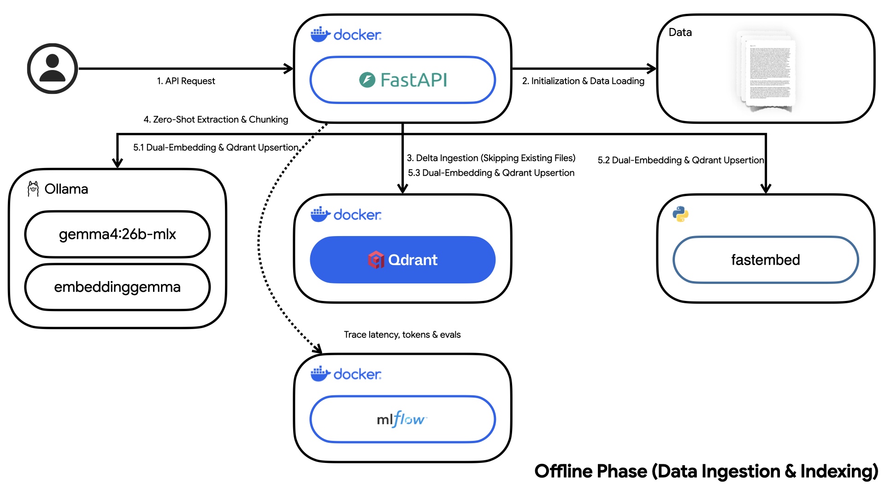
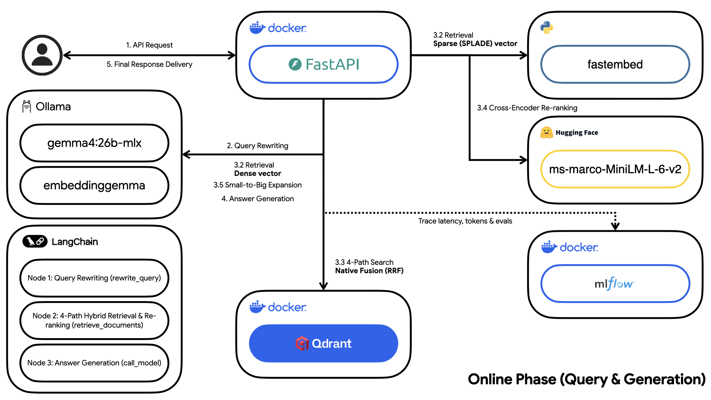

# Retrospect RAG

This project was built as a production-grade ML engineering demonstration, showcasing end-to-end RAG system design from ingestion pipeline architecture through hybrid retrieval, cross-encoder reranking, and LLM-as-judge evaluation.

Retrospect is a modular RAG system for personal journals and diaries.

This project demonstrates a robust architecture for securely ingesting private, first-person entries, zero-shot structured extraction of JSON metadata (emotions, topics, people, places), and orchestrating empathetic LLM generation. Everything is wrapped within a scalable FastAPI service and fully containerized using Docker.

## Architecture: Offline & Online Phases

The system is cleanly decoupled into two distinct operational phases:

### 1. Offline Phase (Data Ingestion & Indexing)
- **Document Processing**: Parses raw diary text files, performing structural and token-based chunking.
- **LLM Metadata Extraction**: Uses a local model (`gemma4:26b-mlx` via Ollama) for zero-shot structured extraction of JSON metadata tracking emotions, sentiment, people, and locations.
- **Embedding Generation**: Converts diary chunks into dense vector representations using `embeddinggemma` via Ollama, and sparse SPLADE vectors via `fastembed`.
- **Temporal Encoding**: Each entry's ISO date is stored twice — as a human-readable string folded into the embedded text, and as an indexed integer (`date_ts`, epoch seconds) that Qdrant can serve range queries against.
- **Vector Storage**: Indexes dense vectors, sparse SPLADE vectors, and extracted metadata filters into **Qdrant** for hybrid search retrieval.



### 2. Online Phase (Query & Generation)
- **Query Rewriting & Self-Querying**: Intercepts natural language questions, stripping conversational filler and enriching the core concepts with probable diary synonyms (e.g., from "sad" to "crying, heartbroken"), while emitting deterministic metadata filters. Every filter is validated through Pydantic (`TranslatedQuery`) before it reaches Qdrant, so an off-vocabulary or malformed value is dropped rather than silently matching zero points.
- **Temporal Filtering**: Today's date is pinned into the rewrite prompt so relative expressions ("last month", "since March") resolve to absolute `date_from` / `date_to` bounds, which become an inclusive Qdrant range condition over the indexed `date_ts` field. Vague life-stage phrases ("in college") are deliberately left to the semantic query instead.
- **Hybrid Retrieval**: Dense and sparse searches run as parallel prefetch paths inside a single `query_points` call, with Qdrant-native RRF fusion — one round-trip, with all fusion logic pushed to the database layer.
- **Cross-Encoder Re-ranking**: Utilizes a Cross-Encoder (`ms-marco-MiniLM-L-6-v2`) to re-rank the fused top results for maximum relevance against the rewritten query.
- **Cyclic Self-Correcting Retrieval**: The graph loops rather than running straight through. A conditional edge inspects each pass — if it came back empty, or if nothing cleared the cross-encoder relevance threshold, control returns to a `relax_retrieval` node that gives up one constraint and searches again. This exists because the failure mode it fixes is real: an over-eager self-query filter excludes every point in the *prefetch* stage, so RRF fusion never sees a candidate and the generation model would otherwise be handed an empty context.
- **Small-to-Big Retrieval**: Retrieves highly specific, smaller chunks via hybrid search, but feeds their larger, complete parent documents to the LLM to provide broader context, deduplicating parent IDs on the fly.

#### The retrieval loop

```text
START → rewrite_query → retrieve_documents → (relevant?) → call_model → END
                                ↑                 │
                                └─ relax_retrieval ┘
```

Each trip around the cycle drops one constraint, so a retry is never a verbatim repeat of the pass that just failed:

| Pass | Strategy | Query | Filters | Pool |
| --- | --- | --- | --- | --- |
| 1 | `filtered` | rewritten | metadata + date | `retrieval_top_k` |
| 2 | `unfiltered` | rewritten | dropped | `retrieval_top_k` |
| 3 | `broad` | verbatim user question | none | `retrieval_broad_top_k` |

Termination is guaranteed three independent ways: the attempt budget (`retrieval_max_attempts`), an exhausted relaxation ladder, and an empty message list. A pass that finds nothing still increments the attempt counter, so the loop cannot spin against a permanently empty store. Rungs that would be no-ops are skipped — a query that produced no filters in the first place jumps straight to `broad` rather than burning an attempt on an identical search. Every pass emits its own MLflow span tagged with its strategy, attempt number, and top score, so the loop is visible in a trace.



## Technology Stack

- **Python 3.12**
- **Framework**: FastAPI
- **LLM/Orchestration**: LangChain & LangGraph
- **Inference**: Ollama
- **Embedding Model**: `embeddinggemma` (dense) + SPLADE via `fastembed` (sparse)
- **Generation Model**: `gemma4:26b-mlx`
- **Vector Store**: Qdrant
- **Observability**: MLflow
- **Evaluation**: Ragas & DeepEval, both judged by a local Ollama model
- **Containerization**: Docker & Docker Compose
- **Tooling**: Make, Pytest, Ruff, Mypy

## Tuning Retrieval

All knobs live in `app/config.py` and can be overridden via environment variables:

| Setting | Default | Purpose |
| --- | --- | --- |
| `RETRIEVAL_TOP_K` | `20` | Candidate pool fetched from Qdrant per pass. |
| `RETRIEVAL_BROAD_TOP_K` | `40` | Wider pool for the final broadened pass. |
| `RETRIEVAL_FINAL_K` | `5` | Re-ranked documents handed to the generation model. |
| `RETRIEVAL_MAX_ATTEMPTS` | `3` | Passes through the retrieval loop. **Set to `1` to disable the loop.** |
| `RETRIEVAL_RELEVANCE_THRESHOLD` | `0.0` | Minimum cross-encoder score for a pass to count as relevant. `ms-marco-MiniLM` emits logits roughly in `-11..+11`, where `>0` indicates relevance. |

## Project Structure

```text
.
├── app/                  # FastAPI application code
│   ├── api/              # API routers and endpoints
│   ├── config.py         # App configuration settings
│   ├── date_utils.py     # Shared date <-> epoch encoding for temporal filters
│   ├── domain/           # Core domain models (Pydantic)
│   ├── graph/            # LangGraph pipeline definition
│   ├── main.py           # FastAPI application entry point
│   ├── prompts.py        # Centralized LLM instruction templates
│   └── services/         # Business logic and external service integrations
├── data/                 # Data directory for document ingestion
├── docker/               # Dockerfiles and container configurations
├── evals/                # Evaluation configurations and scripts
├── tests/                # Unit and integration tests
├── .env.example          # Example environment variables
├── requirements-eval.txt # Pinned DeepEval + Ragas harnesses (installed by `make eval`)
├── docker-compose.yml    # Production Docker services
├── docker-compose.override.yml # Development Docker overrides (hot-reload)
├── Makefile              # Helper commands
└── pyproject.toml        # Python project dependencies and tool configuration
```

## Getting Started

### Prerequisites
- Docker and Docker Compose
- [Ollama](https://ollama.com/) installed and running on your host machine (default port: `11434`)
- Python 3.12 (if running locally without Docker)

### 1. Environment Setup

Copy the example environment file and fill in the required values:
```bash
cp .env.example .env
```

> **Note:** `HF_TOKEN` is used by the application during startup to dynamically download the `ms-marco-MiniLM-L-6-v2` Cross-Encoder model from Hugging Face for re-ranking.

> **Note:** Temporal filtering relies on the `date_ts` payload field, which is written at ingestion time. A collection indexed before that field existed has no dates to range over, so date-bounded queries will match nothing until you re-ingest — `POST /api/v1/admin/ingest` with `{"wipe_first": true}`.

### 2. Running the Application

You can use the provided `Makefile` to manage the application lifecycle:

**Production Mode:**
Builds and starts the full stack (API, Qdrant, MLflow) in detached mode.
```bash
make up
```

**Development Mode (Hot-Reload):**
Builds and starts the stack using the dev override file, which enables live code reloading for the FastAPI service.
```bash
make dev
```

### 3. Stopping the Services

To stop all services while preserving your data (Qdrant vectors, MLflow tracking info):
```bash
make down
```

To stop all services and **wipe all data volumes**:
```bash
make down-clean
```

## Testing & Evaluation

Run unit tests (fast, does not require live API/Ollama):
```bash
make test
```

Run the RAG evaluation suite (requires the full stack + Ollama):
```bash
make eval
```

`make eval` installs the harnesses on demand from `requirements-eval.txt` and runs three tiers over the same live API responses, which are cached so both judges grade identical output:

| Tier | Harness | What it asserts |
| --- | --- | --- |
| 1 | none | Context was retrieved and the answer is non-empty — fails fast before burning judge cycles. |
| 2 | **DeepEval** | Per-sample thresholds on faithfulness, answer relevancy, contextual precision and recall, with a written reason per metric. |
| 3 | **Ragas** | The same four dimensions scored across the dataset in one pass, asserted on the mean — the number to quote when comparing two retrieval configurations. |

Both judges run against local Ollama, so no data leaves the machine and no OpenAI key is needed. Each tier is guarded independently: a missing library skips only its own tier.

> **Note on pinning:** the evaluation dependencies are deliberately *not* in the runtime image — ragas alone pulls in `openai`, `langchain-openai`, `datasets` and `pandas`. They also need careful pinning. `ragas` declares `langchain-core` with no upper bound, so an unconstrained install silently upgrades it underneath the running service, and every published `ragas` version imports `langchain_community.chat_models.vertexai`, which `langchain-community` removed in 0.4.x. `requirements-eval.txt` documents and pins around both.

## Code Quality

Format code using Ruff:
```bash
make format
```

Run linting (Ruff) and type checking (Mypy):
```bash
make lint
```
